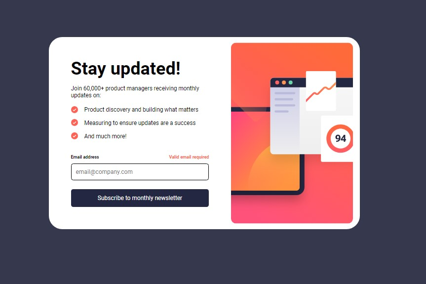

# Frontend Mentor - Newsletter sign-up form with success message solution

This is a solution to the [Newsletter sign-up form with success message challenge on Frontend Mentor](https://www.frontendmentor.io/challenges/newsletter-signup-form-with-success-message-3FC1AZbNrv). Frontend Mentor challenges help you improve your coding skills by building realistic projects. 

## Table of contents

- [Overview](#overview)
  - [Screenshot](#screenshot)
  - [Links](#links)
  - [Built with](#built-with)
  - [What I learned](#what-i-learned)

 
### Screenshot




### Links

- Solution URL: [Github](https://github.com/Hafizshkr/newsletter-sign-up-with-success-message)
- Live Site URL: [Vercel](https://your-live-site-url.com)


### Built with

- Semantic HTML5 markup
- CSS custom properties
- Javascript


### What I learned

What I have learned from this challenge is how to use the Document Object Model (DOM) in JavaScript.

```js
submitBtn.addEventListener("click", function(event){
    event.preventDefault();

    if (!fillTheBox()) {
        return; // If they didn't fill the input, it will block access to the success page.
    }

    if (!inputBox.validity.valid){
        errorMsg.style.display = "block";
        return;
    }
    else {
        subContainer.style.display = "none";
        successContainer.style.display = "block";
        let email = inputBox.value;

        paragraph.innerHTML = `A confirmation email has been sent to <strong>${email}</strong>.
        Please open it and click the button inside to confirm your subscription.`;
     }
})
```

